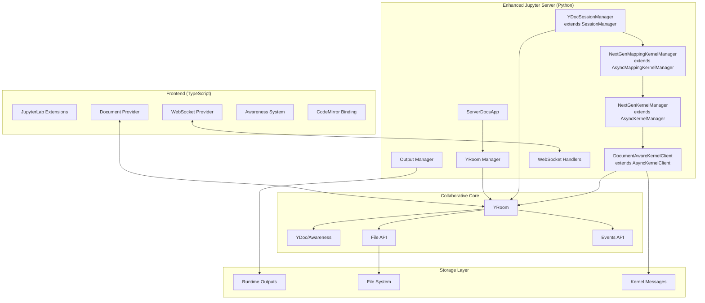
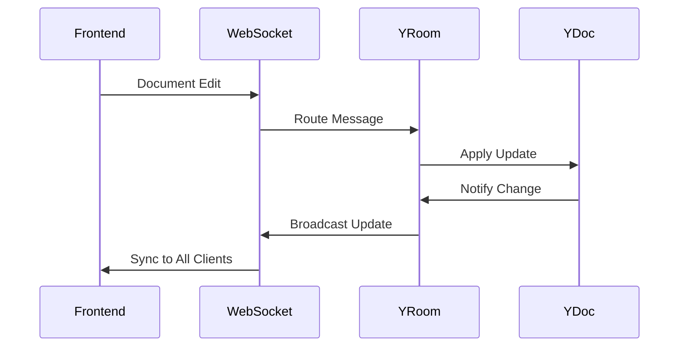
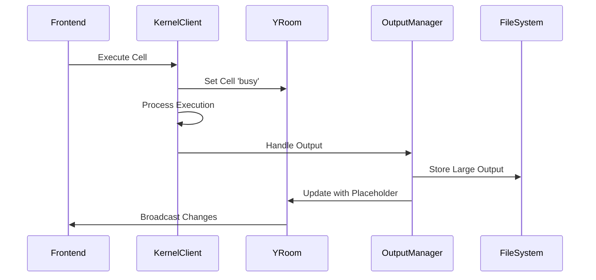

# Jupyter Server Documents - Architectural Analysis

## Overview

Jupyter Server Documents is a powerful JupyterLab extension that **extends** the standard [Jupyter Server Architecture](https://jupyter-server.readthedocs.io/en/latest/developers/architecture.html) with collaborative capabilities. Rather than replacing Jupyter Server components, it enhances them by moving document state to the server and enabling real-time collaboration while maintaining full compatibility with existing Jupyter workflows.

## Relationship to Standard Jupyter Server

Jupyter Server Documents builds upon the standard Jupyter Server foundation by:

- **Extending core components**: SessionManager → YDocSessionManager, KernelManager → NextGenKernelManager, MappingKernelManager → NextGenMappingKernelManager
- **Adding collaborative layer**: New YRoom system for document collaboration
- **Enhancing kernel integration**: DocumentAwareKernelClient with real-time state sharing
- **Maintaining compatibility**: All existing Jupyter Server APIs and protocols preserved

## Key Benefits

- **Real-Time Collaboration**: Enhanced collaborative editing with Y.js integration
- **Performance Optimization**: Intelligent output management and memory usage improvements
- **Improved Kernel Management**: More reliable kernel execution and connection handling  
- **Enhanced Stability**: Better error recovery mechanisms and automatic saving

## Core Architecture



### Enhanced Jupyter Server Components

**jupyter-server-documents extends standard Jupyter Server with:**

1. **YDocSessionManager**: Extends SessionManager with collaborative room integration
2. **NextGenMappingKernelManager**: Extends AsyncMappingKernelManager, disables activity watching/buffering
3. **NextGenKernelManager**: Extends AsyncKernelManager with state broadcasting and connection management
4. **DocumentAwareKernelClient**: Extends AsyncKernelClient with YDoc awareness and real-time collaboration
5. **YRoom System**: New collaborative document management layer

## Component Analysis

### 1. Server Extension Core

**ServerDocsApp** ([`app.py`](jupyter-server-documents/jupyter_server_documents/app.py))
- Main extension entry point that configures the entire system
- Initializes YRoom Manager and Outputs Manager
- Configures custom kernel and session managers
- Registers event schemas and API endpoints
- Sets up compatibility with Jupyter Collaboration API

**Key Configuration:**
```python
c.ServerApp.kernel_websocket_connection_class = "jupyter_server_documents.kernels.websocket_connection.NextGenKernelWebsocketConnection"
c.ServerApp.kernel_manager_class = "jupyter_server_documents.kernels.multi_kernel_manager.NextGenMappingKernelManager"
c.MultiKernelManager.kernel_manager_class = "jupyter_server_documents.kernels.kernel_manager.NextGenKernelManager"
c.ServerApp.session_manager_class = "jupyter_server_documents.session_manager.YDocSessionManager"
```

### 2. Collaborative Document System

**YRoomManager** ([`yroom_manager.py`](jupyter-server-documents/jupyter_server_documents/rooms/yroom_manager.py))
- Manages all collaborative rooms in the server extension
- Automatically restarts updated rooms after inactivity (>10 seconds)
- Provides graceful shutdown with content saving
- Handles room lifecycle and resource management

**YRoom** ([`yroom.py`](jupyter-server-documents/jupyter_server_documents/rooms/yroom.py))
- Individual collaboration instances for documents
- Manages YDoc, Awareness, and client connections
- Implements message queue for ordered processing
- Handles out-of-band changes and file operations
- Supports both document rooms and global awareness

**Enhanced YNotebook** ([`ydocs.py`](jupyter-server-documents/jupyter_server_documents/ydocs.py))
- Extends upstream YNotebook with optimization features
- Implements efficient cell searching with caching
- Reverse scanning optimization for recent cell access
- Provides cell index mapping for performance

### 3. Next-Generation Kernel Management

**DocumentAwareKernelClient** ([`kernel_client.py`](jupyter-server-documents/jupyter_server_documents/kernels/kernel_client.py))
- Kernel client with integrated YDoc awareness
- Real-time cell execution state tracking
- Message caching for proper channel mapping
- Output processing integration
- Immediate cell state updates for queued executions

**Key Features:**
- Sets cells to 'busy' immediately when execute_request is received
- Routes kernel messages to registered YRooms
- Handles kernel info, status, and execution messages
- Integrates with output processor for efficient handling

**NextGenKernelManager** ([`kernel_manager.py`](jupyter-server-documents/jupyter_server_documents/kernels/kernel_manager.py))
- Enhanced kernel lifecycle management
- State broadcasting to connected clients
- Connection management with heartbeat monitoring
- Execution state tracking and validation

### 4. Intelligent Output Management

**OutputsManager** ([`manager.py`](jupyter-server-documents/jupyter_server_documents/outputs/manager.py))
- Separates large outputs from YDoc using placeholder system
- Stores outputs in runtime directory with URL references
- Manages output indexing and display ID tracking
- Handles notebook format upgrades and cell ID generation

**Output Separation Strategy:**
- Large outputs stored as JSON files in `jupyter_runtime_dir()/outputs/`
- YDoc contains lightweight placeholders with URL references
- Automatic cleanup and display ID management
- Lazy loading for improved performance

**OutputProcessor** ([`output_processor.py`](jupyter-server-documents/jupyter_server_documents/outputs/output_processor.py))
- Processes kernel outputs in real-time
- Handles clear_output operations with wait logic
- Transforms IOPub messages to nbformat structure
- Integrates with YDoc for collaborative output updates

### 5. Real-Time Communication

**YRoomWebsocket** ([`yroom_ws.py`](jupyter-server-documents/jupyter_server_documents/websockets/yroom_ws.py))
- WebSocket handler for collaborative sessions
- Validates file IDs and manages room connections
- Routes messages to appropriate YRoom instances
- Handles connection lifecycle and cleanup

**WebSocket Endpoint Configuration:**
```python
# From ServerDocsApp.handlers in app.py
(r"api/collaboration/room/(.*)", YRoomWebsocket)
```

**Endpoint URL Pattern:**
```
ws://localhost:8888/api/collaboration/room/{room_id}
```

**Room ID Format:**
- **Document Rooms**: `{format}:{content_type}:{file_id}`
  - Example: `json:notebook:abc123def456` (notebook files)
  - Example: `json:file:xyz789abc123` (text files)
- **Global Awareness**: `JupyterLab:globalAwareness` (user presence tracking)

**Connection Flow:**
1. Frontend connects to WebSocket endpoint with room_id
2. YRoomWebsocket validates file ID exists via FileIDManager
3. YRoom created/retrieved via YRoomManager
4. Client added to YRoom's YjsClientGroup
5. Real-time YDoc/awareness synchronization begins

**YjsClientGroup** ([`clients.py`](jupyter-server-documents/jupyter_server_documents/websockets/clients.py))
- Manages client connections within rooms
- Tracks sync state (synced/desynced) for each client
- Automatic cleanup of inactive connections
- Graceful connection termination with proper close codes

**Connection States:**
- **Desynced**: New clients before SS1+SS2 handshake
- **Synced**: Clients ready for collaborative editing
- **Stopped**: Room shutdown state, ignores new connections

### 6. Frontend Integration

**WebSocketProvider** ([`yprovider.ts`](jupyter-server-documents/src/docprovider/yprovider.ts))
- Yjs WebSocket synchronization with the server
- File ID management and caching
- Error handling for various disconnection scenarios
- Document widget lifecycle management

**Error Handling:**
- **4000**: Out-of-band changes → reset and reconnect
- **4001**: Out-of-band move/deletion → close tab, notify user
- **4002**: In-band deletion → close tab, notify user

**Global Awareness System**
- Tracks user presence across the application
- Shares current document focus between users
- Provides real-time collaboration indicators

## Key Architectural Patterns

### 1. Event-Driven Architecture
- **YDoc Observers**: React to document changes for saving and broadcasting
- **Kernel Message Listeners**: Process execution messages in real-time
- **Awareness Updates**: Broadcast user presence and cursor positions
- **Message Queuing**: Ordered processing of collaborative updates

### 2. Separation of Concerns
- **Document Structure**: Maintained in lightweight YDoc
- **Large Outputs**: Stored separately in filesystem with URL references
- **Kernel State**: Managed independently with awareness integration
- **User Presence**: Handled through awareness system

### 3. Performance Optimizations

**Memory Management:**
- Output separation prevents YDoc memory bloat
- Automatic room cleanup for inactive sessions  
- Smart caching with reverse cell scanning
- Placeholder system for lightweight document structure

**Network Efficiency:**
- Incremental YDoc synchronization using Y.js
- Compressed WebSocket messages
- Lazy loading of large outputs via HTTP

**Execution Optimization:**
- Immediate cell state updates for user feedback
- Message caching for proper state tracking
- Optimized cell lookup with index caching

### 4. Resilience Patterns

**Connection Recovery:**
- Automatic WebSocket reconnection
- State preservation across disconnections
- Graceful handling of network interruptions

**Error Isolation:**
- Individual room failures don't affect others
- Proper exception handling and logging
- Graceful degradation when components fail

**Data Integrity:**
- Out-of-band change detection and recovery
- Automatic conflict resolution through Y.js CRDTs
- Persistent execution states across sessions

## Data Flow Architecture

### Collaborative Editing Flow


### Cell Execution Flow


## Performance Benefits

### 1. Memory Optimization
- **Output Separation**: Large outputs stored separately, reducing YDoc size
- **Lightweight Placeholders**: URL references instead of full content
- **Automatic Cleanup**: Inactive room memory recovery
- **Smart Caching**: Optimized cell lookup and message caching

### 2. Improved Loading Performance
- **Lazy Output Loading**: On-demand retrieval of large outputs
- **Incremental Sync**: Only sync document changes, not full content
- **Optimized Cell Access**: Reverse scanning for recent cell operations
- **Efficient State Management**: Minimal YDoc structure

### 3. Enhanced Collaboration
- **Real-time Awareness**: Immediate visibility of user actions
- **Conflict-free Resolution**: Y.js CRDT-based synchronization
- **Persistent States**: Execution states survive disconnections
- **Efficient Broadcasting**: Targeted updates to relevant clients

## Key Innovations

### 1. Server-Side Document State
Unlike traditional Jupyter where documents live in the frontend, this architecture moves collaborative state to the server, enabling:
- Better multi-user coordination
- Persistent state across browser sessions
- Server-side conflict resolution
- Enhanced performance through centralized management

### 2. Output Separation Architecture
Large notebook outputs are stored separately from the collaborative document:
- **Benefits**: Lightweight YDoc, faster synchronization, reduced memory usage
- **Implementation**: URL-based references, HTTP-accessible storage, lazy loading
- **Compatibility**: Transparent to existing Jupyter workflows

### 3. Kernel-YDoc Integration
Direct integration between kernel execution and collaborative documents:
- **Real-time State Tracking**: Cell execution states visible to all users
- **Immediate Feedback**: Queue status updates before kernel processing
- **Persistent Awareness**: Execution states survive client reconnections
- **Conflict Prevention**: Proper state synchronization across clients

### 4. Intelligent State Management
Advanced state management for collaborative scenarios:
- **Cell Execution Tracking**: Persistent states across disconnections
- **Out-of-band Detection**: Automatic handling of external file changes
- **Graceful Recovery**: Proper error handling and state restoration
- **Resource Cleanup**: Automatic memory management for inactive sessions

## Extensibility Features

### Configurable Components
- **YRoom Classes**: Custom room implementations via `yroom_class` trait
- **Output Managers**: Pluggable output handling strategies
- **Kernel Managers**: Custom kernel lifecycle management
- **Event Handlers**: Extensible event system for room operations

### Plugin Architecture
- **Document Types**: Support for custom YDoc implementations
- **Awareness Providers**: Multiple collaboration backends
- **Output Processors**: Custom output transformation pipelines
- **WebSocket Handlers**: Extensible message routing

## Dependencies and Integration

### Core Dependencies
- **pycrdt**: Python Y.js implementation for CRDTs
- **jupyter_server**: Base Jupyter server framework
- **jupyter_server_fileid**: File identification service
- **jupyter_ydoc**: Jupyter-specific YDoc implementations
- **jupyter-collaboration-ui**: Frontend collaboration components

### Frontend Dependencies
- **@jupyter/collaborative-drive**: Document provider interfaces
- **y-websocket**: WebSocket synchronization
- **y-protocols**: Awareness and synchronization protocols
- **@jupyterlab/application**: JupyterLab plugin system

## Conclusion

Jupyter Server Documents represents a significant architectural advancement in collaborative notebook environments. By moving document state to the server and implementing intelligent output management, it provides both performance improvements and real-time collaboration capabilities while maintaining backward compatibility with existing Jupyter workflows.

The architecture's key strengths include:
- **Scalable collaboration** through server-side state management
- **Performance optimization** via output separation and smart caching
- **Resilient operation** with comprehensive error handling
- **Extensible design** supporting custom implementations

This foundation enables a more collaborative, stable, and performant JupyterLab experience, particularly valuable for data science teams and educational environments requiring real-time collaboration.