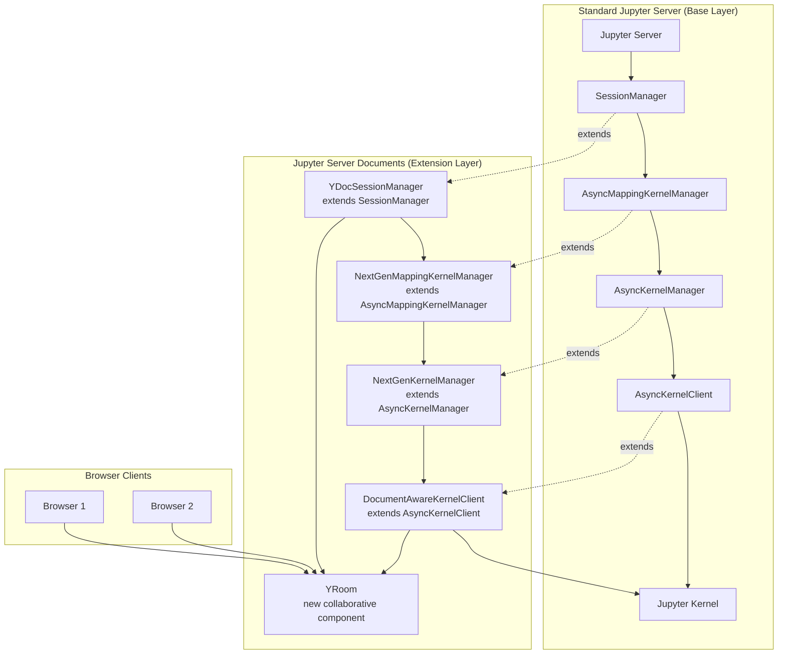
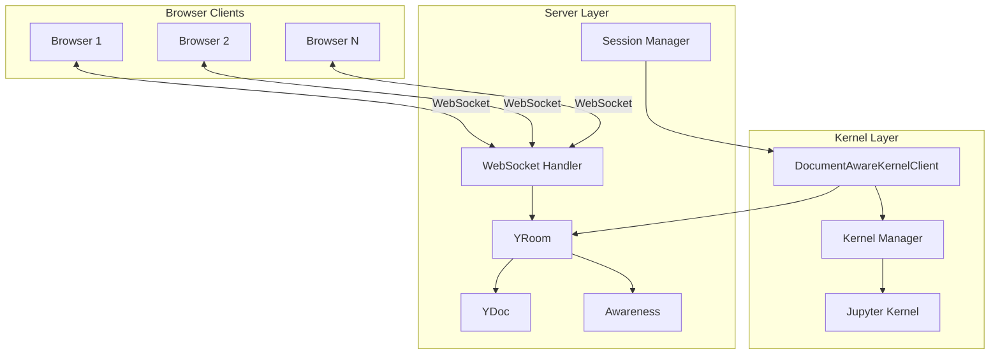
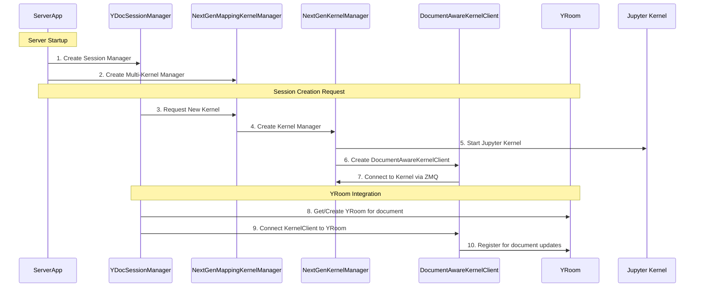
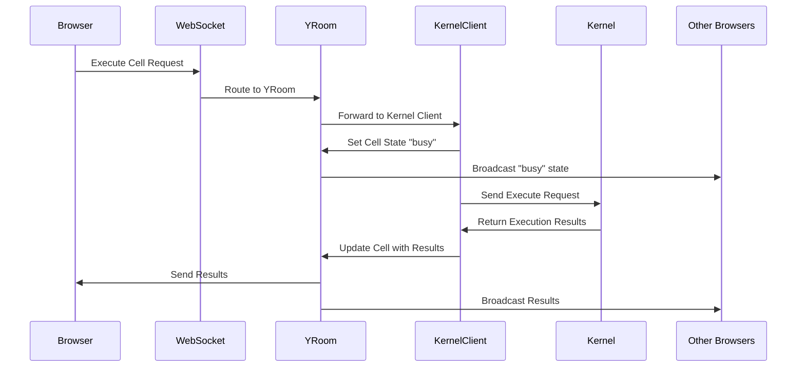
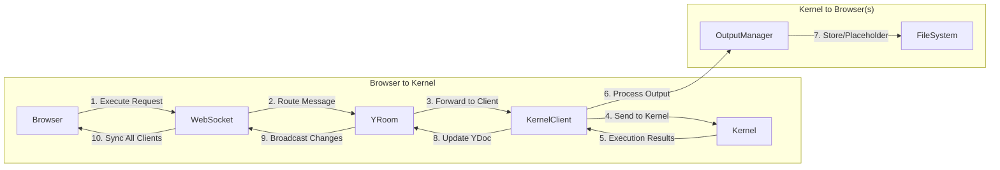
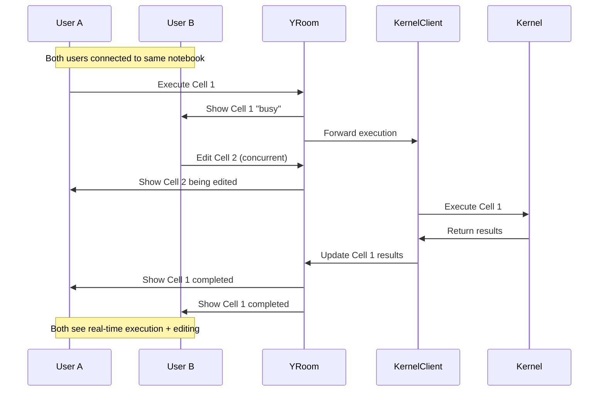

# Kernel-Browser Client Integration in Jupyter Server Documents

## Overview

Jupyter-server-documents **extends** the standard [Jupyter Server Architecture](https://jupyter-server.readthedocs.io/en/latest/developers/architecture.html) by adding a **collaborative layer** on top of the existing kernel management system. Rather than replacing Jupyter Server components, it enhances them with document-aware capabilities and real-time collaboration features.

## Relationship to Standard Jupyter Server Architecture

### Standard Jupyter Server Components (Enhanced)


### Architecture Extensions

**jupyter-server-documents enhances standard Jupyter Server by:**

1. **SessionManager → YDocSessionManager**: Adds YRoom integration to standard session management
2. **AsyncMappingKernelManager → NextGenMappingKernelManager**: Disables activity watching and buffering for collaborative use
3. **AsyncKernelManager → NextGenKernelManager**: Enhances kernel lifecycle with collaborative state management
4. **AsyncKernelClient → DocumentAwareKernelClient**: Adds YDoc awareness and real-time state broadcasting
5. **New Component - YRoom**: Introduces collaborative document management layer

### Compatibility Preservation

The extension maintains **full compatibility** with standard Jupyter Server:
- All existing Jupyter Server APIs remain functional
- Standard kernel protocols are preserved
- Existing notebook formats are supported
- Traditional single-user workflows continue to work

Instead of direct kernel-browser communication, the architecture introduces a **server-side collaborative layer** that coordinates between kernels and multiple browser clients through YRooms and awareness systems.

## Architecture Components



## Component Creation Lifecycle

The creation and initialization of kernel-related components follows a specific sequence orchestrated by the ServerDocsApp configuration:

### 1. Server Extension Configuration

**ServerDocsApp** ([`app.py`](jupyter-server-documents/jupyter_server_documents/app.py:82)) configures custom component classes:

```python
def _link_jupyter_server_extension(self, server_app):
    """Setup custom config needed by this extension."""
    c = Config()
    # Configure custom session manager
    c.ServerApp.session_manager_class = "jupyter_server_documents.session_manager.YDocSessionManager"
    
    # Configure custom kernel managers
    c.ServerApp.kernel_manager_class = "jupyter_server_documents.kernels.multi_kernel_manager.NextGenMappingKernelManager"
    c.MultiKernelManager.kernel_manager_class = "jupyter_server_documents.kernels.kernel_manager.NextGenKernelManager"
    
    # Configure custom WebSocket connection
    c.ServerApp.kernel_websocket_connection_class = "jupyter_server_documents.kernels.websocket_connection.NextGenKernelWebsocketConnection"
    
    server_app.update_config(c)
```

### 2. Component Creation Hierarchy



### 3. Detailed Creation Process

#### Session Manager Creation
```python
# YDocSessionManager inherits from Jupyter's SessionManager
class YDocSessionManager(SessionManager):
    def __init__(self, *args, **kwargs):
        super().__init__(*args, **kwargs)
        self._room_ids = {}  # Track room IDs by session ID
        
    @property
    def yroom_manager(self) -> YRoomManager:
        """Access to the collaborative room manager"""
        return self.serverapp.web_app.settings["yroom_manager"]
```

#### Kernel Manager Creation
```python
# NextGenKernelManager extends AsyncKernelManager
class NextGenKernelManager(AsyncKernelManager):
    # Custom client class for document awareness
    client_class = DottedObjectName(
        "jupyter_server_documents.kernels.kernel_client.DocumentAwareKernelClient"
    )
    
    async def start_kernel(self, *args, **kwargs):
        # Set initial states
        self.set_state(LifecycleStates.STARTING, ExecutionStates.STARTING)
        out = await super().start_kernel(*args, **kwargs)
        self.set_state(LifecycleStates.STARTED)
        
        # Schedule connection (non-blocking)
        asyncio.create_task(self.connect())
        return out
        
    async def connect(self):
        """Create and connect the DocumentAwareKernelClient"""
        self.main_client = self.client()  # Creates DocumentAwareKernelClient
        self.main_client.add_listener(self.execution_state_listener)
        
        # Start channels and listening (ZMQ for local kernels, WebSocket for gateway)
        self.main_client.start_channels()
        await self.main_client.start_listening()
        
        # Wait for kernel to be ready
        while self.execution_state != ExecutionStates.IDLE.value:
            self.main_client.send_kernel_info()
            await asyncio.sleep(0.1)
```

#### Kernel Client Creation
```python
class DocumentAwareKernelClient(AsyncKernelClient):
    def __init__(self, *args, **kwargs):
        super().__init__(*args, **kwargs)
        self._yrooms = set()  # Connected YRooms
        self.message_cache = KernelMessageCache(parent=self)
        self.output_processor = OutputProcessor(parent=self)
        
    async def start_listening(self):
        """Start listening to kernel messages via anyio task group"""
        async def _listening():
            async with anyio.create_task_group() as tg:
                for channel_name in ["shell", "control", "stdin", "iopub"]:
                    tg.start_soon(self._listen_for_messages, channel_name)
        
        self._listening_task = asyncio.create_task(_listening())
        
    async def add_yroom(self, yroom: YRoom):
        """Connect this kernel client to a collaborative room"""
        self._yrooms.add(yroom)
```

#### YRoom Integration
```python
# In YDocSessionManager.create_session()
async def create_session(self, path, name, type, kernel_name, kernel_id):
    # Create standard Jupyter session first
    session_model = await super().create_session(path, name, type, kernel_name, kernel_id)
    
    if type == "notebook":
        # Create real path for file ID mapping
        real_path = os.path.join(os.path.split(path)[0], name)
        
        # Get or create YRoom for this document
        yroom = self._init_session_yroom(session_id, real_path)
        
        # Connect YRoom to kernel client
        kernel_client = self.get_kernel_client(kernel_id)
        await kernel_client.add_yroom(yroom)
        
    return session_model

def _init_session_yroom(self, session_id: str, path: str) -> YRoom:
    """Create YRoom and map it to the session"""
    file_id = self.file_id_manager.index(path)
    room_id = f"json:notebook:{file_id}"
    yroom = self.yroom_manager.get_room(room_id)
    self._room_ids[session_id] = room_id
    return yroom
```

## YRoom WebSocket Endpoint

### Endpoint Configuration

**ServerDocsApp Handler Registration** ([`app.py`](jupyter-server-documents/jupyter_server_documents/app.py:17)):
```python
handlers = [
    (r"jupyter-server-documents/get-example/?", RouteHandler),
    (r"api/collaboration/room/(.*)", YRoomWebsocket),  # Main YRoom endpoint
    (r"api/fileid/index", FileIDIndexHandler),         # File ID mapping
    *outputs_handlers                                  # Output management
]
```

### WebSocket URL Pattern
```
ws://localhost:8888/api/collaboration/room/{room_id}
```

### Room ID Format
- **Document Rooms**: `{format}:{content_type}:{file_id}`
  - `json:notebook:abc123def456` - Notebook collaboration
  - `json:file:xyz789abc123` - Text file collaboration
- **Global Awareness**: `JupyterLab:globalAwareness` - User presence tracking

### YRoomWebsocket Handler Lifecycle

**URL Processing** ([`yroom_ws.py`](jupyter-server-documents/jupyter_server_documents/websockets/yroom_ws.py:38)):
```python
def prepare(self):
    # Extract room_id from URL: /api/collaboration/room/{room_id}
    request_path: str = self.request.path
    self.room_id = request_path.strip("/").split("/")[-1]
    
    # Validate file exists (except global awareness)
    if self.room_id != "JupyterLab:globalAwareness":
        fileid = self.room_id.split(":")[-1]
        path = self.fileid_manager.get_path(fileid)
        if not path:
            raise HTTPError(404, f"No file with ID '{fileid}'.")
```

**Connection Establishment** ([`yroom_ws.py`](jupyter-server-documents/jupyter_server_documents/websockets/yroom_ws.py:51)):
```python
def open(self, *_, **__):
    # Create or get existing YRoom for this room_id
    yroom = self.yroom_manager.get_room(self.room_id)
    if not yroom:
        raise HTTPError(500, f"Unable to initialize YRoom '{self.room_id}'.")
    self.yroom = yroom

    # Add this WebSocket as a client to the YRoom
    self.client_id = self.yroom.clients.add(self)
    if not self.client_id:
        self.close(code=1001)  # Server shutting down
        return
```

**Message Routing** ([`yroom_ws.py`](jupyter-server-documents/jupyter_server_documents/websockets/yroom_ws.py:67)):
```python
def on_message(self, message: bytes):
    if not self.client_id:
        self.close(code=1001)
        return

    # Route all messages to YRoom for ordered processing
    self.yroom.add_message(self.client_id, message)

def on_close(self):
    if self.client_id:
        # Remove client from YRoom when connection closes
        self.yroom.clients.remove(self.client_id)
```

### Frontend WebSocket Connection

**WebSocketProvider Connection** ([`yprovider.ts`](jupyter-server-documents/src/docprovider/yprovider.ts:189)):
```typescript
// Initialize YWebsocketProvider to connect to YRoom
this._yWebsocketProvider = new YWebsocketProvider(
    this._serverUrl,  // ws://localhost:8888/api/collaboration/room
    `${this._format}:${this._contentType}:${this._fileId}`, // Room ID
    this._sharedModel.ydoc,
    {
        disableBc: true,
        awareness: this.awareness
    }
);
```

**Connection Flow:**
1. Frontend gets file ID via `/api/fileid/index` endpoint
2. Constructs room_id: `json:notebook:{file_id}`
3. Connects WebSocket to: `/api/collaboration/room/json:notebook:{file_id}`
4. YRoomWebsocket validates file exists and creates/gets YRoom
5. Client added to YRoom's client group for collaborative sync
6. Real-time YDoc/awareness synchronization begins

## Integration Flow

### 1. Session Establishment

**YDocSessionManager** ([`session_manager.py`](jupyter-server-documents/jupyter_server_documents/session_manager.py:11)) coordinates the connection:

```python
async def create_session(self, path, name, type, kernel_name, kernel_id):
    # Create standard Jupyter session
    session_model = await super().create_session(path, name, type, kernel_name, kernel_id)
    
    # Get YRoom for this document
    yroom = self._init_session_yroom(session_id, real_path)
    
    # Connect YRoom to kernel client
    kernel_client = self.get_kernel_client(kernel_id)
    await kernel_client.add_yroom(yroom)
```

**Key Integration Points:**
- Each notebook session gets a corresponding **YRoom** 
- The **DocumentAwareKernelClient** is connected to the YRoom
- Multiple browser clients can connect to the same YRoom

### 2. Cell Execution Coordination

When a user executes a cell in their browser:



### 3. Real-Time State Synchronization

**DocumentAwareKernelClient** ([`kernel_client.py`](jupyter-server-documents/jupyter_server_documents/kernels/kernel_client.py:20)) provides the core integration:

```python
def handle_incoming_message(self, channel_name: str, msg: list[bytes]):
    """Handle outgoing kernel messages and update YRoom state"""
    
    # IMPORTANT: Set cell to 'busy' immediately when execute_request is received
    if msg_type == "execute_request" and channel_name == "shell" and cell_id:
        for yroom in self._yrooms:
            yroom.set_cell_awareness_state(cell_id, "busy")
```

**Key Features:**
- **Immediate State Updates**: Cells show '*' prompt immediately when queued
- **Multi-Client Awareness**: All connected browsers see execution state changes
- **Persistent State**: Execution states survive browser disconnections

### 4. Message Flow Architecture



## Key Integration Mechanisms

### 1. Awareness System Integration

**Real-time execution state sharing:**
```python
# In DocumentAwareKernelClient
case "status":
    content = self.session.unpack(dmsg["content"])
    execution_state = content.get("execution_state")
    
    for yroom in self._yrooms:
        awareness = yroom.get_awareness()
        if awareness is not None:
            # Update kernel execution state for all clients
            awareness.set_local_state_field("kernel", {"execution_state": execution_state})
            
            # Store cell execution state for persistence
            if cell_id:
                yroom.set_cell_execution_state(cell_id, execution_state)
                yroom.set_cell_awareness_state(cell_id, execution_state)
```

### 2. Output Management Integration

**Collaborative output handling:**
```python
# In OutputProcessor
async def output_task(self, msg_type, cell_id, content):
    """Process kernel outputs for collaborative display"""
    
    # Get file ID and notebook context
    file_id = self.file_id_manager.get_id(path)
    notebook = await self.get_jupyter_ydoc(file_id)
    
    # Process output (separate large outputs)
    if self.use_outputs_service:
        output = self.transform_output(msg_type, content, ydoc=False)
        output = self.outputs_manager.write(file_id, cell_id, output, display_id)
    
    # Update collaborative document
    _, target_cell = notebook.find_cell(cell_id)
    if target_cell is not None:
        target_cell["outputs"].append(output)
```

### 3. Message Caching System

**Mapping responses to requests:**
```python
# In DocumentAwareKernelClient
self.message_cache.add({
    "msg_id": msg_id,
    "channel": channel_name,
    "cell_id": cell_id
})

# Later, when processing responses:
parent_msg_data = self.message_cache.get(parent_msg_id)
cell_id = parent_msg_data.get('cell_id') if parent_msg_data else None
```

## Client-Side Integration

### Browser WebSocket Provider

**Connection management** ([`yprovider.ts`](jupyter-server-documents/src/docprovider/yprovider.ts:33)):
```typescript
// Connect to collaborative room
this._yWebsocketProvider = new YWebsocketProvider(
    this._serverUrl,
    `${this._format}:${this._contentType}:${this._fileId}`,
    this._sharedModel.ydoc,
    {
        disableBc: true,
        awareness: this.awareness
    }
);
```

### Frontend Awareness Integration

**Real-time collaboration indicators:**
```typescript
// Global awareness for user presence
const awareness = new Awareness(ydoc);
awareness.setLocalStateField('user', user.identity);
awareness.setLocalStateField('current', current_document);

// Cell execution state awareness  
awareness.setLocalStateField('cell_execution_states', cellStates);
```

## Detailed Execution Flow

### Cell Execution Process

1. **User Action**: User clicks "Run" in browser
2. **WebSocket Message**: Execute request sent via WebSocket to YRoom
3. **Immediate Feedback**: YRoom immediately sets cell state to "busy"
4. **State Broadcast**: All connected browsers see cell execution indicator
5. **Kernel Routing**: Message forwarded to DocumentAwareKernelClient
6. **Kernel Execution**: Traditional Jupyter kernel processes the cell
7. **Output Processing**: Results processed by OutputManager (large outputs separated)
8. **YDoc Update**: Results stored in collaborative document
9. **State Synchronization**: Final state broadcast to all clients
10. **UI Update**: All browsers show updated results

### Multi-User Coordination

**Scenario: User A executes cell while User B is editing**



## Performance Optimizations

### 1. Lazy Output Loading
- Large outputs stored separately from YDoc
- Browser loads outputs on-demand via HTTP
- Collaborative document remains lightweight

### 2. State Persistence
- Cell execution states survive browser disconnections
- Kernel connection status shared across clients
- Automatic state recovery on reconnection

### 3. Efficient Broadcasting
- Only changed cells trigger updates
- Incremental YDoc synchronization
- Targeted awareness updates

## Error Handling & Recovery

### Connection Loss Recovery
```typescript
// In WebSocketProvider
private _onConnectionClosed = (event: CloseEvent): void => {
    const close_code = event.code;
    
    if (close_code === 4000) {
        // Out-of-band change: reset and reconnect
        this._handleOobChange();
    } else if (close_code === 4001) {
        // File moved/deleted: close tab
        this._handleOobMove(); 
    }
    // ... other error codes
};
```

### Kernel Recovery
```python
# In NextGenKernelManager  
async def connect(self):
    """Robust kernel connection with state recovery"""
    self.main_client = self.client()
    self.main_client.add_listener(self.execution_state_listener)
    
    # Wait for heartbeat and idle state
    while not self.main_client.hb_channel.is_alive():
        attempt += 1
        if attempt > self.connection_attempts:
            raise Exception("Kernel connection timeout")
        await asyncio.sleep(0.5)
```

## Summary

The kernel-browser client integration in jupyter-server-documents creates a **collaborative execution environment** where:

1. **Multiple browsers** can connect to the same notebook session
2. **Real-time awareness** shows execution states across all clients  
3. **Server-side coordination** manages kernel communication and state
4. **Efficient output handling** separates large results from collaborative document
5. **Robust error recovery** handles disconnections and file changes gracefully

This architecture transforms Jupyter from a single-user tool into a true collaborative platform while maintaining full compatibility with existing kernel protocols and notebook formats.